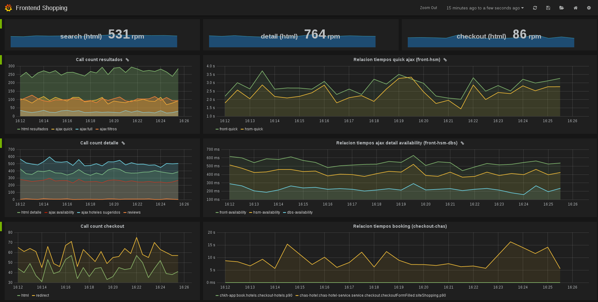

Khronus - A reactive time series database [](https://travis-ci.org/despegar/khronus)
======

## Overview

Khronus is a open source distributed reactive time series database. It is designed to store, analyze and process a huge amount of metrics.

It measures well. It correctly and precisely analyzes and processes timers and gauges using the great [HdrHistogram] by Gil Tene. It is space-efficient and has data tunable retention policies. It relies on both `Akka Cluster` and `Cassandra` to scale and be resilient.

It is very fast to query `percentiles, counts, min, max` and other forms of metrics, even if they have a lot of samples.

Khronus does not have its own dashboard to graph its metrics. It is focused on analyzing and retrieving time series data. It can be integrated with `Grafana` through the `InfluxDB api` though.

## Status

Khronus is being actively developed. It is currently being used in production at [Despegar.com]

## Features

* Support for `timers, gauges and counters`.
* Configurable series resolution (30 seconds, 1 minute, 10 minutes, etc).
* Percentiles done right. No more average of averages.
* Fast, very fast retrieval of metrics.
* Highly scalable.
* Highly available.
* REST Api for pushing data.
* Grafana integration through the InfluxDB api.

## Installation

### Download Khronus

Go to releases and download the last stable version.

### Install a Cassandra cluster

Khronus requires Cassandra 2.x. For installation read the [official documentation](https://wiki.apache.org/cassandra/GettingStarted)

### Configure

The main config file for overriding properties is located at `../conf/application.conf`. Some useful configurations:

```javascript
khronus {
  // bind host
  endpoint = "127.0.0.1"
  port = 9290
  
  windows {
    // Delay the current time to avoid losing measures pushed after the current tick
    // It must be less than the minor window
    execution-delay = 20 seconds
  }

  internal-metrics {
    // all internal metrics has the preffix ~system
    enabled = true
  }

  histogram {
    // resolutions to be pre calculated
    windows = [30 seconds, 1 minute, 5 minutes, 10 minutes, 30 minutes, 1 hour]
    // expiration ttl
    bucket-retention-policy = 6 hours
    // expiration ttl
    summary-retention-policy = 90 days
  }

  counter {
    // resolutions to be pre calculated
    windows = [30 seconds, 1 minute, 5 minutes, 10 minutes, 30 minutes, 1 hour]
    // expiration ttl
    bucket-retention-policy = 6 hours
    // expiration ttl
    summary-retention-policy = 90 days
  }
  
  dashboards {
    // nroOfPoints = period / resolution
    // if the number of points is less than the minor, scale up in resolution
    min-resolution-points = 700
    // if the number of points is greater than the max, scale down in resolution
    max-resolution-points = 1500
  }

  master {
    // tick to process all the metrics
    tick-expression = "0/30 * * * * ?"
    // delay to send discovery (for new workers) message
    discovery-start-delay = 1 second
    discovery-interval = 5 seconds
  }

  cassandra {
    cluster {
      seeds = "127.0.0.1"
      port = 9042
      // useful is you are using an existing cluster
      keyspace-name-suffix = ""
    }

    meta {
      // replication factor
      rf = 3
    }

    buckets {
      // replication factor
      rf = 1
    }

    summaries {
      // replication factor
      rf = 1
    }
  }
}
```

### Run
```
 ./bin/khronus
```
## Implementation details

  * Scala
  * Akka cluster
  * Spray.io
  * HdrHistogram
  * Cassandra


## Screenshots


  
## Query syntax for Grafana

#### Projections
As with any query language, you can select the fields you want to see in the resulted graph. Your query can project:

  * **Some specific function:** Supported functions depend on the type of the metric.
    * for counters: count
    * for timers or gauges: count, max, min, mean, p50, p80, p90, p95, p99, p999

```sql
    select max , min as minimum from "metricTimer" where time > now()-6h group by time(5m)
    select count from "metricCounter" where time > now()-6h group by time(5m)
```
    As you can see, alias for functions are supported, even they are not required


  * **All functions:** Using '*' you'll get all the supported functions for the given metric type

```sql
	select * from "metricTimer" where time > now()-30m group by time(5m) 
```

  * **Percentiles function:**
	 If you are searching for a timer or a gauge you can use ```sql percentiles``` function to return all supported percentiles: 50, 80, 90, 95, 99, 999
	 Besides that, if you are looking for some specific percentiles you can use the function percentiles(50 80 99), passing the desired parcentiles as arguments 

```sql
    select percentiles from "metricTimer" where time > now()-1h group by time(5m)
	select percentiles(50 80 99) from "metricTimer" where time > now()-6h group by time(5m)
```
	
  * **A number:** In this case an alias is required and if you pass a fractional number, it will be rounded.

```sql
	select -9.87 as negativeNumber from "metricTimer" where time > now()-6h group by time(5m)
```
		
								
  * **A binary operation:**
    Operands can be an scalar or an specific function. In the latter case, you must use a metric alias
 	Supported operators are: +, -, *, /
	Alias for the operation result is required

```sql
	select timer.max - timer.min as myOperation from "metricTimer" as timer where time > now()-6h group by time(5m)
	select timer.max  *  -1 as myOperation from "metricTimer" as timer where time > now()-6h group by time(5m)
```


#### From metrics...

Many metrics are supported in queries. They can have an alias. If you are projecting an operation, metrics **must** have an alias to refer to.

```sql
    select counter.count  + timer.count as total from "metricTimer" as timer, "metricCounter" as counter where time > now()-2h group by time(5m)
```

If you don't specify which metric your function refers to, the result is one series with the function for each specified metric:
   
```sql
    select count from "metricTimer" as timer, "metricCounter" as counter where time > now()-6h group by time(5m)
```
        	
You can use regular expression in order to match metrics. If the regex matches more than one metric, you can't use an alias (So you can't project operations). 
The following query will return a series with the count per each metric that matches the regular expression

```sql
	select count from "metric.*" where time > now()-6h group by time(5m)
```


#### Filtering

You can filter data using the following keywords: "where", "time", "between", "and" and the operators: >, >=, <, <=

The time series "from" is always required. You can use > or >=
```sql
    select count from "metricCounter" where time > now() - 1h group by time(5m)
```

The time series "to" is not required, but you can use < or <=

```sql
	select count from "metricCounter" where time > now() - 3m and time < now() - 50s group by time(5m)
```

As shown in the examples, in order to specify times you can use the function now() with some modifiers to substract seconds (s), minutes (m), hours (h), days (d) or weeks (w). 
Besides that, you can specify a timestamp like this:

```sql
	select count from "metricCounter" where time > 1419878249000 group by time(5m)
	select count from "metricCounter" where time > 1419878249s group by time(5m)
```	
	
Another example, using between
```sql    
    select count from "metricCounter" where time between 1419878249s and 1419878599s group by time(5m)
```
		
#### Group by 

This clause is always required because it defines the granularity or resolution of the response.
If you don't use a valid configured window, it will be adjusted to the nearest configured window (or to the best window given the maximum and the minimum resolution configured).

The clause is 'group by time(n suffix)', where n is a number and suffix is s (seconds), m (minutes) or h (hours):

```sql
	select * from "metricTimer" where time > now() -1h group by time(30s)
```

As we said, even if you use a valid configured window the result resolution could be adjusted depending on the maximum and minimum resolution configured. 
If you don't want this behavior you can use the 'force' keyword. But take in account that it could be a slow operation if you are querying a large period of time with a high resolution:

```sql
	select * from "metricTimer" where time > now() -1h force group by time(30s)
```

#### Other optional clauses
  * limit number
  * order [asc|desc] 
  * fill(doubleValue): Complete the time series with this number when there is no value
  * scale(doubleValue): Multiply all values by this factor

```sql
    select a.count as counter , cc.count, 3 as miConstant, cc.count + a.count as sum from "metricTimer" as a, "metricCounter" as cc where time >= now() - 10m group by time(1h) fill(-1) scale(0.1) limit 100 order asc
```

  
## Contributions

`Khronus` is open to the community to collaborations and contributions

[HdrHistogram]: http://hdrhistogram.org/  "HdrHistogram"
[Despegar.com]: http://www.despegar.com/ "Despegar.com"
